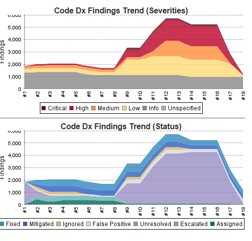

# SRM (formerly Code Dx) Jenkins Plugin

Allows Jenkins to push source and build artifacts to [SRM](https://www.blackduck.com/software-risk-manager.html) (formerly known as Code Dx) and display the aggregated results of its [full
suite](https://documentation.blackduck.com/bundle/srm/page/user_guide/Analysis/importing_scan_results.html)
of analysis tools.

#### Notes

- This plugin is maintained by Black Duck Software, Inc.
- Plugin version 3.0.0 and later support Pipelines projects as well as Freestyle
- **Plugin version 4.0.0 includes fixes for [CVE-2023-2195, CVE-2023-2631](https://www.jenkins.io/security/advisory/2023-05-16/#SECURITY-3118), [CVE-2023-2633, CVE-2023-2632](https://www.jenkins.io/security/advisory/2023-05-16/#SECURITY-3146), [CVE-2023-2196](https://www.jenkins.io/security/advisory/2023-05-16/#SECURITY-3145)**
  - This is a breaking change - see [changelog.md](changelog.md#code-dx-jenkins-plugin-400-released-5102023) for more info and guidance

## Features

-   Upload your source, binaries, and/or scan file(s) from your Jenkins
    jobs to your SRM installation easily
-   Scan your source and binaries for potential vulnerabilities and
    quality issues using SRM
-   SRM is an application vulnerability correlation and management
    system that supports C/C++, C\#, Java/JSP, Javascript, PHP, Python,
    Ruby on Rails, Scala, and Visual Basic .NET
-   See SRM finding trends right in Jenkins
-   Prevent serious issues from slipping through the cracks by
    configuring Jenkins to fail your builds with customizable SRM
    findings criteria

## Requirements

Jenkins 2.200 or later, and an [SRM installation](https://www.blackduck.com/software-risk-manager.html) deployment with an API Key created from the SRM admin page.

## Documentation

Consult the latest [SRM online
documentation](https://documentation.blackduck.com/bundle/srm/page/plugins_guide/Jenkins/overview.html) for
instructions on how to configure your build.

[Changelog](./changelog.md)

## Contact

[Visit the Black Duck Community Forums for support.](https://community.blackduck.com/s/)
